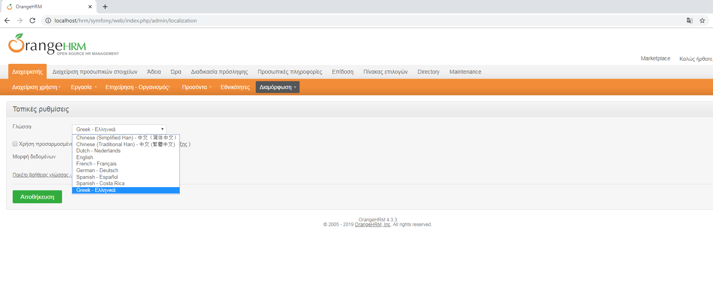
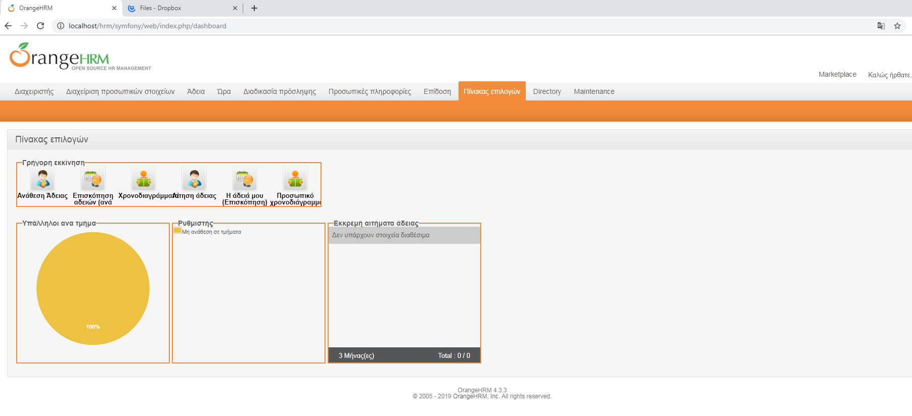
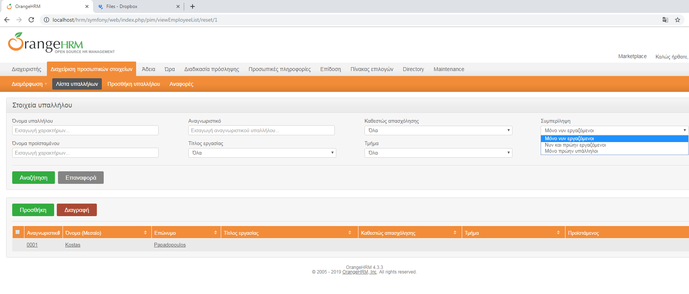
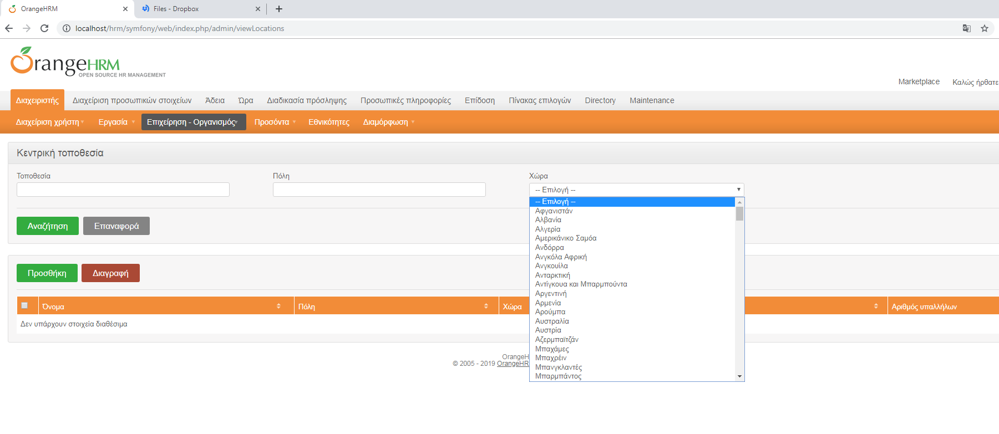

						                  OrangeHRM
						     
A greek contributed version of OrangeHRM 4.3.3, Human Resource Management (HRM) System that captures all the essential functionalities required for any enterprise or public organization. Copyright (C) 2006 [OrangeHRM Inc](https://www.orangehrm.com/).

**Analytical installation instructions** could be acquired from [here](https://www.orangehrm.com/open-source/orangehrm-installation/).

**Language selection**

**General view**

**Employee view**

**Organization view**

